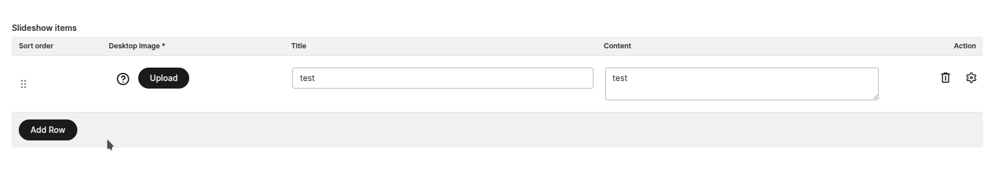
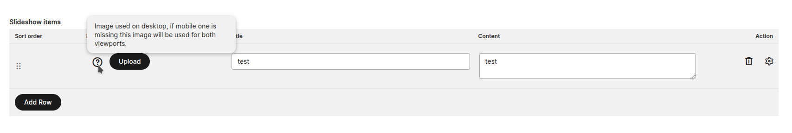
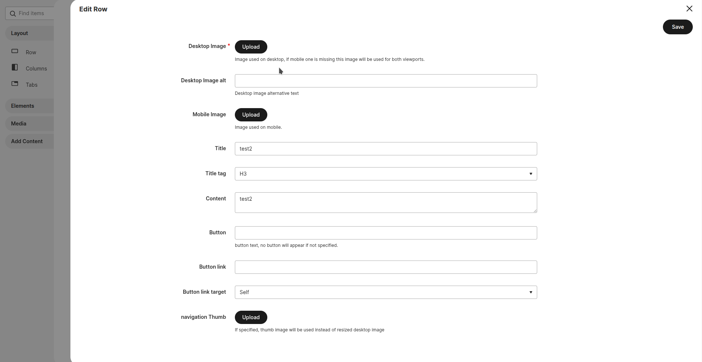
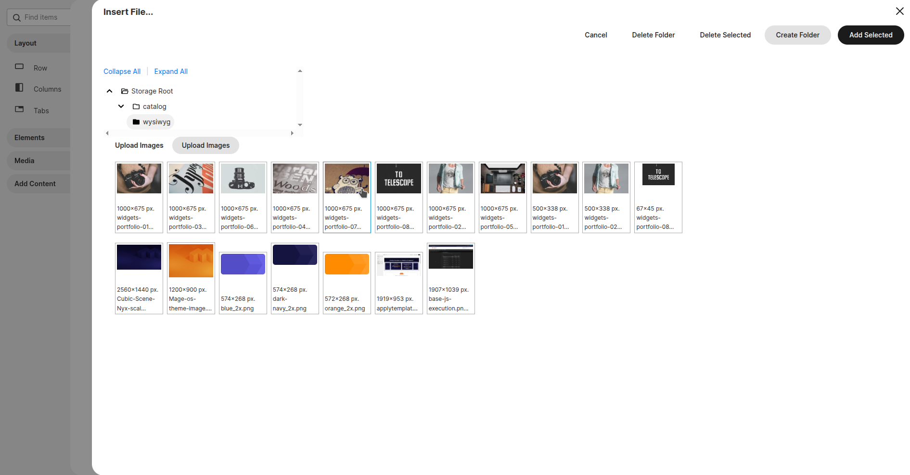
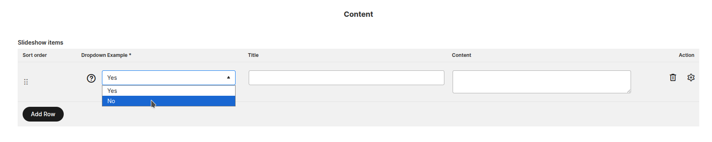

# MageOS AdvancedWidget Module for Magento

Add configurable multi-row CMS Widgets with image picker component, product picker component, select fields and much more.

---

## Overview

The **AdvancedWidget** module allows you to define multi-row CMS widgets.
These features combined with MageOS_PageBuilderWidget module (that is explicit dependency) make finally possible to develop custom pagebuilder components with own preview and a large set of configurations.
Complex pagebuilder ui components development is no more needed.


## 🚀 Features

> 1) This module let you specify Title separators inside widgets
   

> 2) This module let you specify multiple "repeatable" sections where you can specify unlimited rows inside widgets
   
>
>> 2.1) Each item field can receive a dedicated tooltip
   
> 
>> 2.2) Each field is validated and ask to be required for compilation
   
>
>> 2.3) Items can be sorted
   
> 
>> 2.4) You can specify whether a field is editable directly in the main box or whether it must be edited in the detail modal.
   
 
> 3) Row item images fields are available
   
   

> 4) Row item select fields are available
   

> 5) Row item product fields are available
   
    

 
## 🔧 Installation

1. Install it into your Mage-OS/Magento 2 project with composer:
    ```
    composer require mage-os/module-advanced-widget
    ```

2. Enable module
    ```
    bin/magento module:enable MageOS_AdvancedWidget
    bin/magento setup:upgrade
    ```

## 🤝 Changelog

Please see [CHANGELOG](CHANGELOG.md) for more information on what has changed recently.


## 📄 License

The MIT License (MIT). Please see [License File](LICENSE) for more information.

### Attribution

This software uses Open Source software. See the [ATTRIBUTION](ATTRIBUTION.md) page for these projects.
